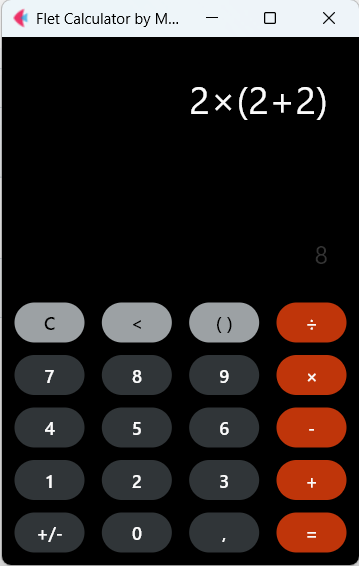

A simple calculator made in Python language using the Flet framework, inspired by applications found on Android devices.
The calculator features support for creating parentheses, order of operations, and live preview of calculations.
The application was developed without using the eval() function.

