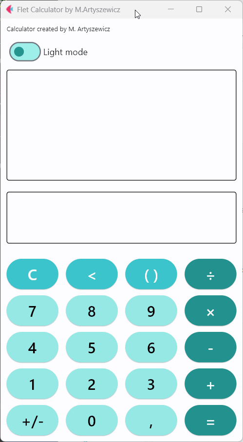

A simple calculator made in Python language using the Flet framework, inspired by applications found on Android devices.
The calculator features support for creating parentheses, order of operations, and live preview of calculations.
The application was developed without using the eval() function.

To run the application on a computer, you need to download the repository and enter the following commands in the terminal:
pip install requirements.txt
python main.py
To run the application on an Android device, you need to download the app-release.apk file onto the device and allow the device to install the application.
